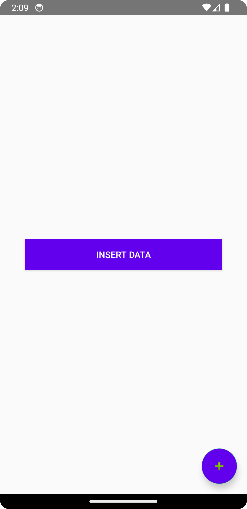
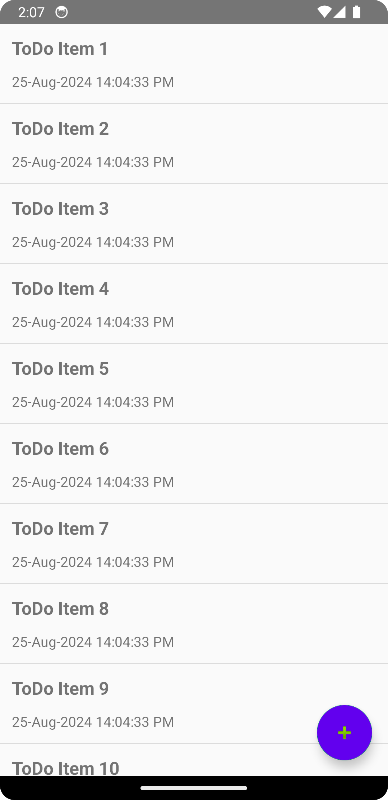
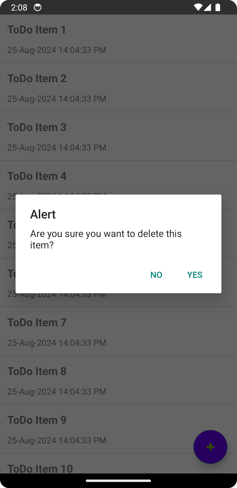
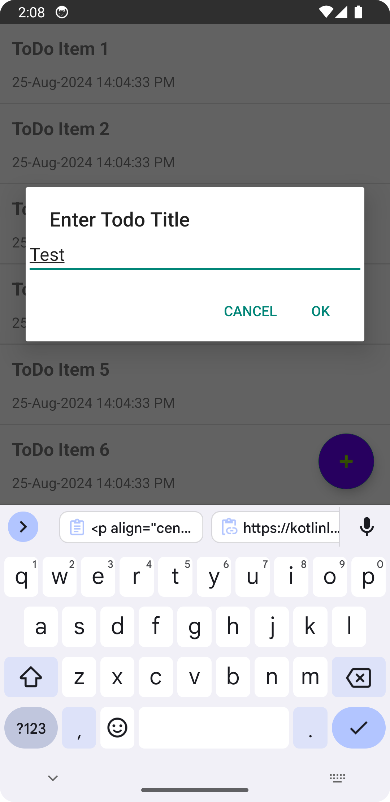

<p align="center">
    <a>
    
    </a>
    <h1 align="center">ToDo List App</h1>
</p>

## 🌟 About
A simple To-Do List App that helps you create, delete and bulk insert to-do list. Built with Kotlin, stores the data in a local database using Sqlite and uses the paging library for pagination.

## ✨ Screenshots

<div style="display:flex;">




</div>

## 🚀 Getting Started
These instructions will get you a copy of the project up and running on your local machine for development and testing purposes.

### Prerequisites
*   Android Studio
*   Java JDK

## 📃 Libraries used
- [Kotlin](https://kotlinlang.org/) - First class and official programming language for Android development.
- [Coroutines](https://kotlinlang.org/docs/reference/coroutines-overview.html) - For asynchronous and more..
- [SQLite](https://developer.android.com/training/data-storage/sqlite) - SQLite object mapping library.
- [RecyclerView](https://developer.android.com/jetpack/androidx/releases/recyclerview) - Display large sets of data in your UI while minimizing memory usage.
- [Material Components for Android](https://github.com/material-components/material-components-android) - Modular and customizable Material Design UI components for Android.
- [ViewBinding](https://developer.android.com/topic/libraries/view-binding) - Generates a binding class for each XML layout file present in that module and allows you to more easily write code that interacts with views.
- [Pagination](https://developer.android.com/topic/libraries/architecture/paging/v3-overview) - The Paging library helps you load and display pages of data from a larger dataset from local storage or over a network.
- [SQLite Testing](https://developer.android.com/training/data-storage/room/testing-db#android) - The recommended approach for testing your database implementation is writing a JUnit test that runs on an Android device. Because these tests don't require creating an activity, they should be faster to execute than your UI tests.

## 🔨 Build and Run Application

Follow these steps to get a Working Project!
```
1. Clone this repository or download the file
2. Extract the zip if the downloaded code
3. Open the project in Android Studio
4. Wait while Android Studio Download gradle or required files
5. Hit Run Button!
```

## 🔨 Steps to test the app and run the test cases
Follow these steps to test the app!
```
1. Launch the app
2. Click on insert data button to bulk insert the data [Refer: [Screenshot_20240825_140931.png]]
3. Use a long press on the item to trigger the delete alert and follow the instructions [Refer: [Screenshot_20240825_140830.png]]
4. Use add fab to trigger the add to-do item alert and follow the instructions [Refer: [Screenshot_20240825_140847.png]]
5. To run the test case please go to [TodoApp/app/src/androidTest/java/com/example/todoapp/DatabaseHelperTest.kt]
6. DatabaseHelperTest covers insertion, deletion and retrieval cases
```
